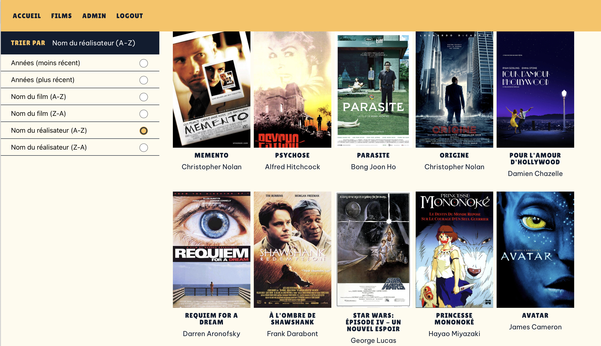

# Project Videoclub

This is an online movie club for fans to access to informations of movie, review films and share their comments. The website is created with React and fed by data from an online API. [Please click here to check this API projet.](https://github.com/ymei2296236/cadriciel-front)

## Steps to test the project
1. cd videoclub

2. npm install

3. npm start (the project is hosted on Render, so the first loading of the site normally takes about 1 minute)

4. testing account
 - user name: test4@gmail.com
 - password: 12345Aa!
